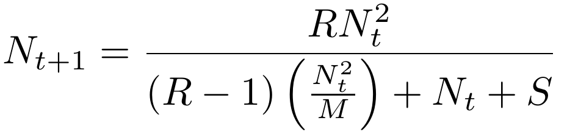

# Proyecto: *Modelos discretos de control de poblaciones de insectos al introducir insectos estériles*

=====================

## Autores:

- Sofía Cruz T. (**@cutsof**)

- Daniel Martínez U.(**@danmarurr**)

- Pablo Reséndiz V. (**@Pablorv**)

=====================

En este proyecto se estudia el mapeo que modela el control de poblaciones de insectos mediante la inserción de `S` insectos estériles. Dicho mapeo está dado por:

donde `R` y `M` son parámetros que controlan la rapidez de crecimiento de población y el valor de población final respectivamente.

